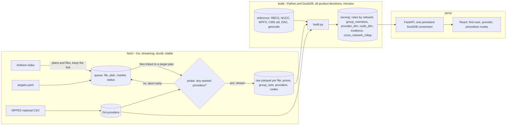
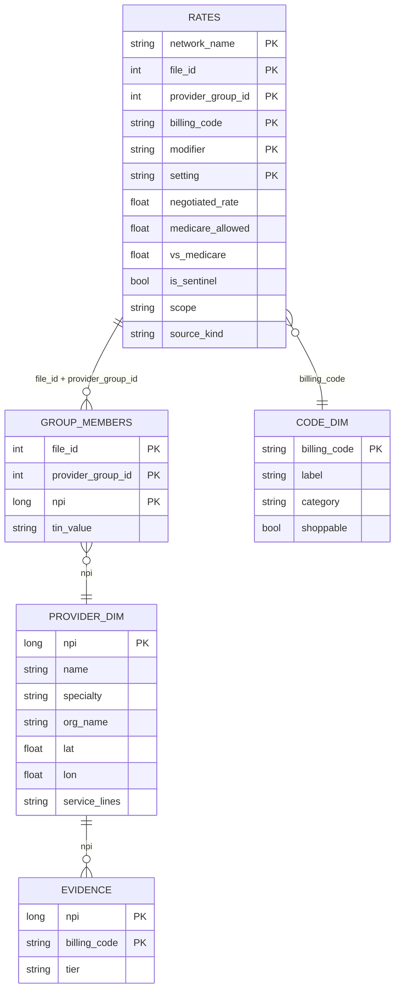
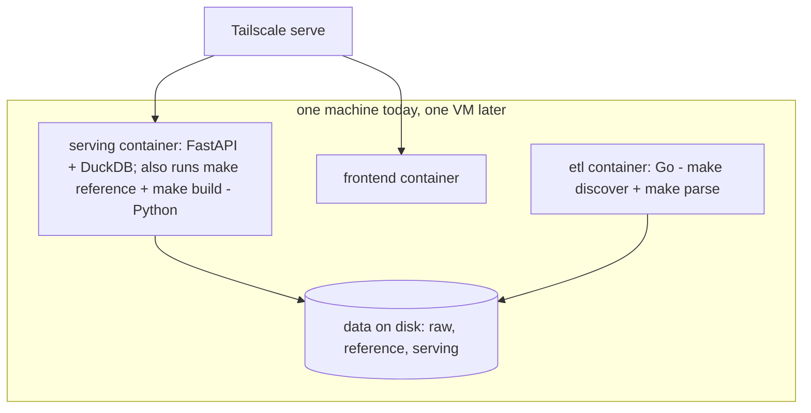

# Architecture

*The standing architecture diagrams — one per **boundary**, not one per
component (a component diagram goes stale the first time a file moves). Read
this for how the pieces fit; read the per-topic docs in the
[AGENTS.md doc map](../AGENTS.md#where-to-look) for how each one works.*

Diagrams render on github.com; the GitHub mobile app sometimes shows the source
instead. Labels are plain text so every Markdown renderer has a chance.

## Layers

| Layer | Tech | Dir | Purpose |
|---|---|---|---|
| Discovery | Go + Postgres | `etl/discovery/` | Monthly metadata sync of MRF URLs into the `index_files` queue; keeps the plan→file link (`index_file_plans`) |
| Extraction | Go (streaming JSON) | `etl/extraction/` | Parses gzipped MRFs in one pass → raw Parquet; a provider probe aborts a download before `in_network` when no wanted provider is in it |
| Reference | Go (NPPES) + Python/DuckDB (RBCS, NUCC, CMS utilization, MPFS, DAC, geocode) | `etl/nppes/`, `reference/` | External public datasets → dimension Parquet |
| Build | Python + DuckDB | `build/` | Raw + reference Parquet → the serving tables; every product decision (scope, sentinel, benchmark, service lines, rule 5) lives here — [build/build.md](../build/build.md) |
| Serving | Python + DuckDB | `serving/` | Queries the Parquet globs in-process via FastAPI (`localhost:8000`) |
| Frontend | React + Vite | `frontend/` | Rate explorer — `localhost:5173` |
| Storage | Parquet + ZSTD | `data/` | `data/anthem/`, `data/nppes/`, `data/reference/`, `data/cms/`, `data/serving/` — [docs/schema.md](schema.md) |
| Queue DB | Postgres 15 | `db/` | `index_files` + `index_file_plans` + `billing_codes` + `coverage_log` |

The Go CLI (`etl/`, one module) dispatches from `main.go` to the `discovery` /
`extraction` / `nppes` / `fixture` packages; shared structs, config, and the
progress reader live in `etl/core/`. Docker services: `db`, `etl`, `serving`,
`frontend` — each from a multi-stage Dockerfile in
[deploy/](../deploy/README.md) (`prod` target = deployable artifact; compose
runs the `dev` target).

## Data flow

## Serving entity model (grain = provider group)

`rates` is Hive-partitioned by `net=` exactly as `prices` is today, so every
plan-scoped query prunes to one directory. `source_kind` is `plan_specific` or
`shared` and drives AGENTS.md rule 5, which the read layer applies (the build
keeps every row). `cross_network_rollup` `(code, network) → n_groups, p10,
median, p90` replaces `/rates/by_network`'s live scan and `summary/rate_summary`.
The physical `rates` table also carries `service_code`, `negotiated_type`,
`negotiation_arrangement`, `expiration_date` — the ERD names the grain, not
every column, and that grain is not unique (POS variants, multi-roster rates).

## Runtime

The `discover → parse → reference → build` chain runs across the etl (Go) and
serving (Python) containers; a single `make refresh` wrapper is a Step 6 tidy.

Postgres stays for the queue; replacing it with a small Parquet/CSV queue is a
later, separate issue.
